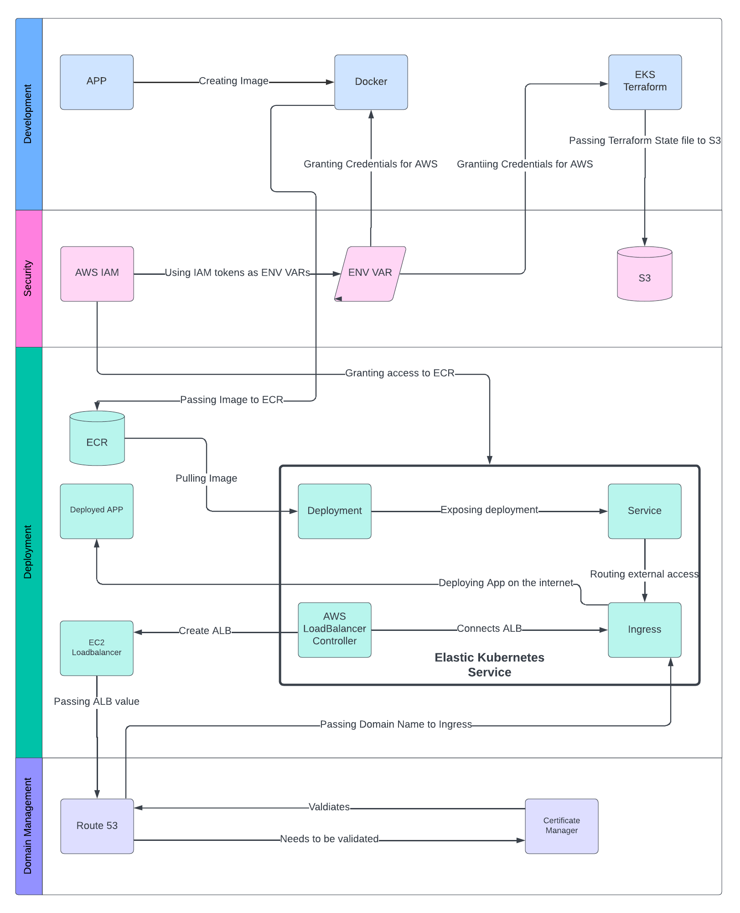

# Kubernetes and DevOps Project

www.noahns.com

## Summary
The link above directs to the website I deployed and orchestrated using Terraform, Docker, AWS, and Kubernetes. With Terraform, I designed and created the infrastructure for this GitHub repository and my Elastic Kubernetes Service (EKS) on AWS, utilizing environment variables for security and S3 to protect my Terraform state files.

To deploy my application on the EKS cluster, I used Docker to create an image of my application. I then pushed it to my Elastic Container Repository (ECR) on AWS, allowing the EKS cluster to access the containerized application. I deployed the application from ECR to EKS using a deployment to manage the pods, alongside a service load balancer and an ingress to make the application accessible on the web.

Additionally, I used Route 53 and Certificate Manager on AWS to obtain and validate my domain name.

# Tools used:

  &nbsp;&nbsp;&nbsp;&nbsp;&nbsp;&nbsp;&nbsp;&nbsp;&nbsp;&nbsp;
  &nbsp;&nbsp;&nbsp;&nbsp;&nbsp;&nbsp;&nbsp;&nbsp;&nbsp;&nbsp;
  &nbsp;&nbsp;&nbsp;&nbsp;&nbsp;&nbsp;&nbsp;&nbsp;&nbsp;&nbsp;
  

# Project Flow Chart

